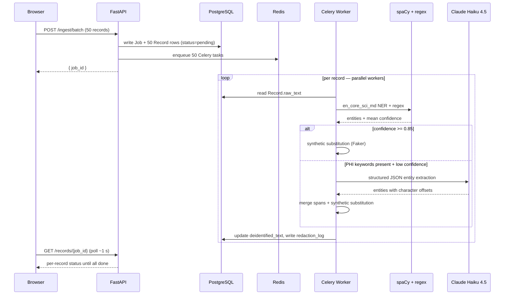
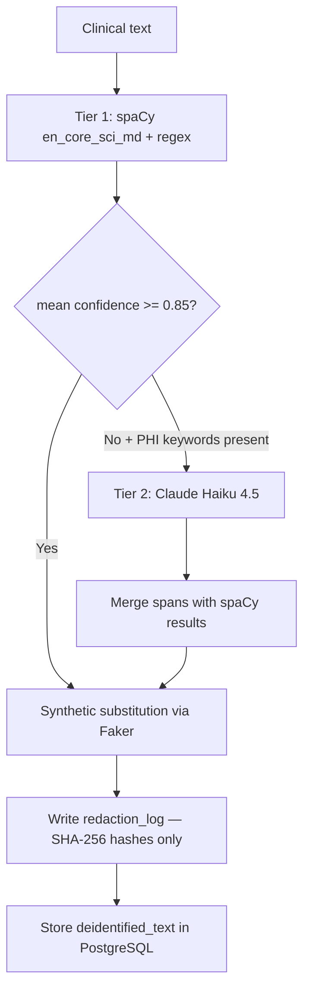

# PHI De-identification Pipeline — spaCy · Claude Haiku 4.5 · FastAPI · Celery

Production-grade **healthcare PHI detection and synthetic substitution pipeline** with a two-tier strategy:
spaCy biomedical NER handles ~90% of records as tier-1; Claude Haiku 4.5 covers ambiguous fallbacks.
Detected entities are replaced with Faker-generated synthetic equivalents — not blank redaction — preserving
analytical signal. Full observability via structured JSON logs, Prometheus metrics, and OpenTelemetry traces → Jaeger.

> **Demo batch:** 50 clinical records generated on the fly · ~350 PHI entities detected and replaced · <10% of records reach Claude · 3 parallel Celery workers · real-time progress with per-record Jaeger trace links

---

## Live Service

| Endpoint | URL |
|---|---|
| **App** | available on demand |
| **Portfolio demo** | https://bganguly.github.io/#phi_deidentification |

> ECS Fargate runs weekdays 8 am – 5 pm PT; the pipeline diagram and browser demo are always available via the portfolio.

---

## Using the App

1. **Open the Browser demo** — from the portfolio page, click **Browser demo**. Paste any clinical text (or use the prefilled example) and click **De-identify**. Claude Haiku 4.5 detects PHI entities and returns synthetic replacements in real time. An Anthropic API key is required.
2. **Run the Batch job** — click **Batch run** to generate 50 synthetic clinical records and submit them to the live Cloud Run API. Three parallel Celery workers process them concurrently; per-record progress streams in real time.
3. **Inspect a Jaeger trace** — after the batch run, click any Jaeger link in the results table to see the full OTel span: which tier fired, confidence score, entity count, and substitution time.
4. **Explore the Pipeline diagram** — click **Pipeline** for the architecture walkthrough of a single record through spaCy tier-1 and Claude fallback, with annotated span decisions.

### Iterative use patterns

The browser demo is stateless — each paste-and-run is independent. The batch run creates a `job_id`; progress is polled at `GET /records/{job_id}` until all 50 records complete.

**Patterns that work well:**

| What you want | How to do it |
|:--|:--|
| Test tier-1 detection | Paste text with clear SSNs, MRNs, or dates — spaCy/regex hits at 0.97 confidence, Claude is never called |
| Force the Claude fallback | Paste clinical text with PHI in unusual syntax (e.g., `"pt is J.Smith"`) — spaCy misses it, confidence drops to 0.40, fallback fires |
| Verify a specific entity type | Paste a note with only phone numbers or only addresses to confirm that entity type is detected and substituted |
| Inspect a trace | After a batch run, click the Jaeger link for any record to see the full OTel span: which tier detected PHI, confidence score, entity count, and substitution time |
| Check the audit trail | `redaction_log` stores SHA-256 hashes of every original PHI value — verify a value was present without retaining raw PII |

**Practical tips:**

- **Confidence threshold is 0.85** — set `CONFIDENCE_THRESHOLD=1.0` in `.env` to disable Claude entirely and keep all data on your infrastructure (HIPAA-safe mode).
- **Synthetic substitution preserves structure** — dates are shifted ±30 days (not nulled), names → `faker.name()`, SSNs → `faker.ssn()`. Downstream analytics on de-identified output remain valid.
- **Original PHI is never stored** — the audit log holds SHA-256 hashes only. The hash lets auditors verify a value was present without raw PII in the database.
- **Batch job is async** — `POST /ingest/batch` returns a `job_id` immediately; poll `GET /records/{job_id}` to check progress. The browser batch demo does this automatically once per second.

---

## Architecture

### Processing flow — step by step

1. **Records generated in the browser** — 50 clinical notes constructed from randomised Faker values (name, SSN, MRN, DOB, address, phone, physician). Each note contains 6–8 PHI entities.
2. **POST /ingest/batch** — FastAPI writes a `Job` row and 50 `Record` rows to PostgreSQL (`raw_text` persisted, `deidentified_text` null, `status = pending`), enqueues one Celery task per record onto Redis, returns `job_id` immediately.
3. **Tier-1: spaCy + regex** — each Celery worker reads its `Record` and runs `en_core_sci_md` NER + regex patterns. Produces a list of detected entities and a mean confidence score.
4. **Tier-2: Claude fallback** — if spaCy/regex finds nothing but PHI-indicator keywords are present (confidence → 0.40, below 0.85), Claude Haiku 4.5 is called. Returns structured JSON with character offsets; new spans are merged without duplicating spaCy results.
5. **Synthetic substitution** — entities sorted by character offset descending so replacements don't shift earlier spans. Each span is string-spliced with a Faker value matched to its type.
6. **Two writes, one commit** — `Record.deidentified_text` updated and one `redaction_log` row written per entity: SHA-256 hash of original value, Faker replacement, entity type, confidence, and detecting model. Original PHI never stored.
7. **Browser polls** — `GET /records/{job_id}` once per second until all 50 records show `done`.



### Two-tier detection routing



### Key design decisions

| Concern | Approach |
|:--|:--|
| **Two-tier detection** | spaCy handles the common case cheaply (~90% of records); Claude is invoked only when spaCy confidence drops below 0.85 — minimises API cost while catching edge cases |
| **Synthetic substitution over redaction** | Faker replacements preserve entity structure (dates stay dates, names stay names) so downstream analytics on de-identified data remain valid |
| **SHA-256 audit log** | Original PHI values are hashed before storage — auditors can verify a specific value was present without raw PII in the database |
| **Per-record confidence, not per-entity** | The 0.85 threshold is evaluated on the mean confidence across all entities found in a record; Claude is only called when spaCy has no confident detections at all |
| **Offset-descending substitution** | Applying replacements from last span to first ensures earlier span offsets remain valid throughout the substitution loop |
| **Time-limited tokens** | HMAC-SHA256 bearer tokens with 48h expiry via `grant-access.sh` — no long-lived credentials exposed |


## Deployment / Running

```bash
./scripts/deploy.sh        # local Docker Compose or Cloud Run
./scripts/infra-down.sh    # stop local stack or tear down cloud
```

Local prerequisites: Python 3.11+. An `ANTHROPIC_API_KEY` is prompted on first run.
Local stack starts: FastAPI API · Celery worker · PostgreSQL 16 · Redis 7 · Jaeger · Prometheus · Grafana.

---

## Stack

| Component | Implementation |
|---|---|
| **Tier-1 detection** | spaCy `en_core_sci_md` biomedical NER: PERSON, DATE, GPE, LOC, ORG (confidence 0.90); regex patterns: SSN, MRN, PHONE, EMAIL (confidence 0.97) |
| **Tier-2 detection** | Claude Haiku 4.5 via Anthropic SDK; invoked only when spaCy/regex finds nothing but PHI-indicator keywords (`patient`, `ssn`, `mrn`) are present; returns structured JSON with character offsets |
| **Confidence threshold** | 0.85 per-record mean; configurable via `CONFIDENCE_THRESHOLD` env var; set to 1.0 to disable Claude entirely |
| **Synthetic substitution** | Faker-generated replacements per entity type; applied by offset descending to avoid span-shift bugs |
| **Audit log** | SHA-256 hash of every original PHI value written to `redaction_log` in PostgreSQL with entity type, confidence, and detecting model — no raw PII retained |
| **Async batch processing** | FastAPI `POST /ingest/batch` writes job + record rows to PostgreSQL, enqueues one Celery task per record onto Redis; returns `job_id` immediately |
| **Auth** | HMAC-SHA256 time-limited bearer tokens; `grant-access.sh` issues 48h tokens |
| **Observability** | Prometheus `/metrics` endpoint; OpenTelemetry traces → Jaeger (OTLP gRPC 4317); structured JSON logging per record |
| **Backend** | FastAPI 0.115 + asyncpg; Celery workers consume Redis queue; Alembic DDL migrations on PostgreSQL 16 |
| **IaC** | Terraform (`infra/`) — GKE cluster, Cloud SQL, Artifact Registry, VPC; `k8s/` manifests with HPA for worker autoscaling; `cloudbuild.yaml` for Cloud Build |

---
